# Candy Shop
Diploma project for [TeachMeSkills](https://teachmeskills.by/).

## Description

### Task:
Создать интернет магазин сладостей. На главной странице отображены виды сладостей. Пользователь может переходить по различным категориям и 
выбирать сладости и их количество, добавляя их в корзину. На каждой странице имеется кнопка позволяющая перейти к оформлению заказа. На 
странице оформления заказа отображена сводная по заказу и форма для ввода данных покупателя: имя, фамилия, почта, номер телефона, время 
доставки, адрес доставки, а также комментарий к заказу. Сладость и категории сладостей добавляются на странице админа.

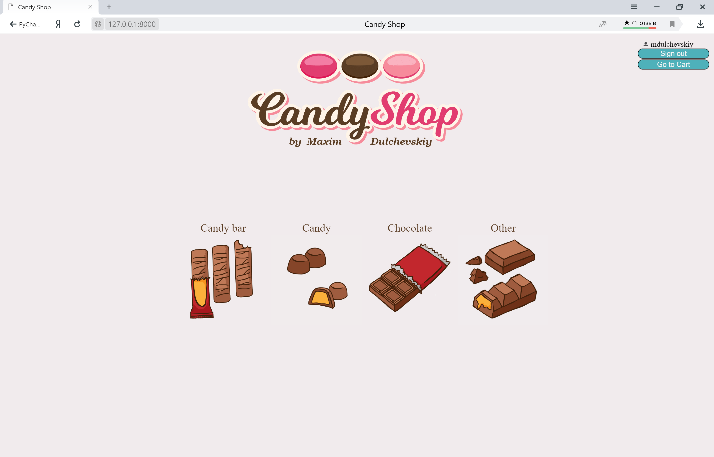 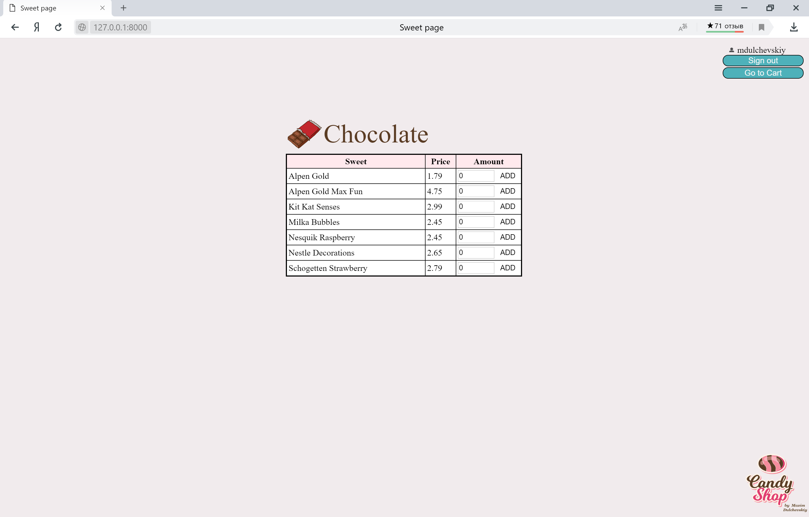 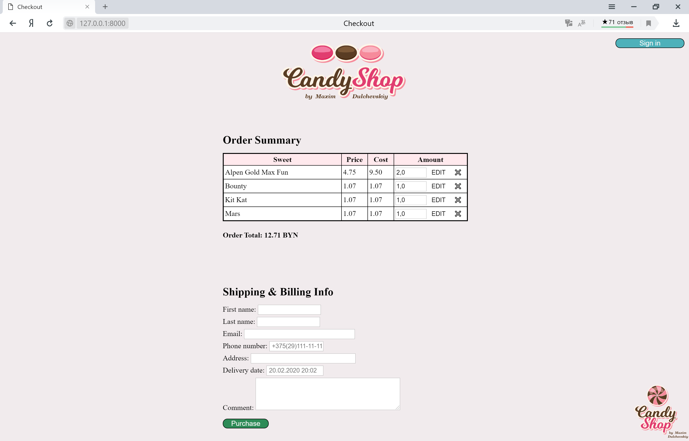

### Additional tasks:
- добавить отправку подтверждения заказа на почту покупателю и админу;

<p align="center">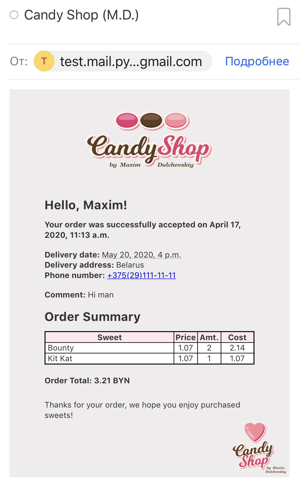</p>

- добавить возможность регистрации и логина. Зарегистрированные пользователи на форме заказа должны вводить только адрес и время доставки;

<p align="center">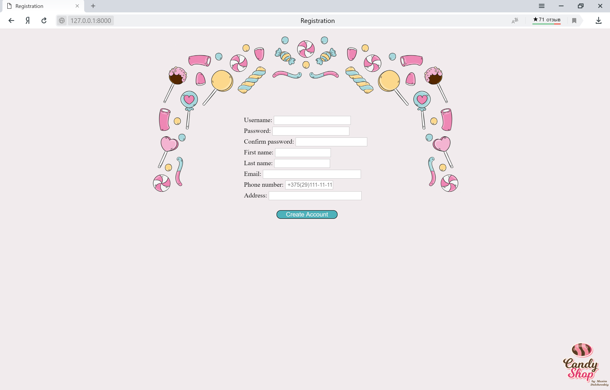 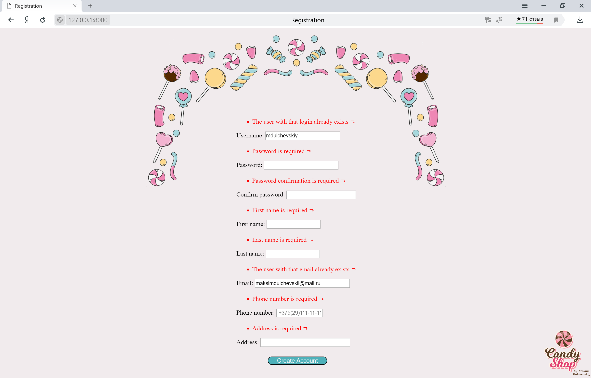 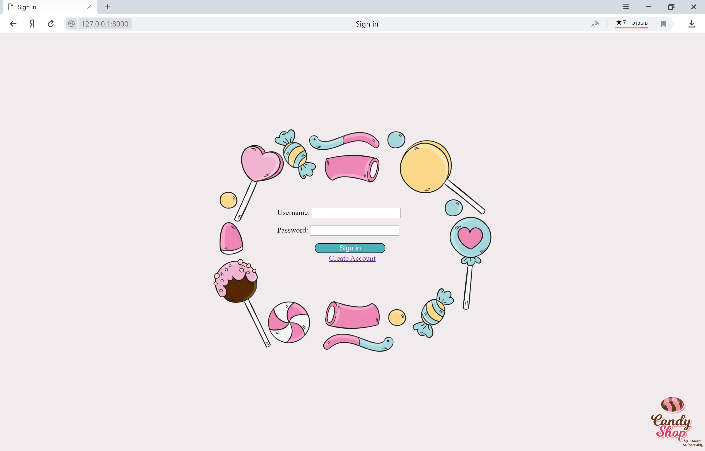 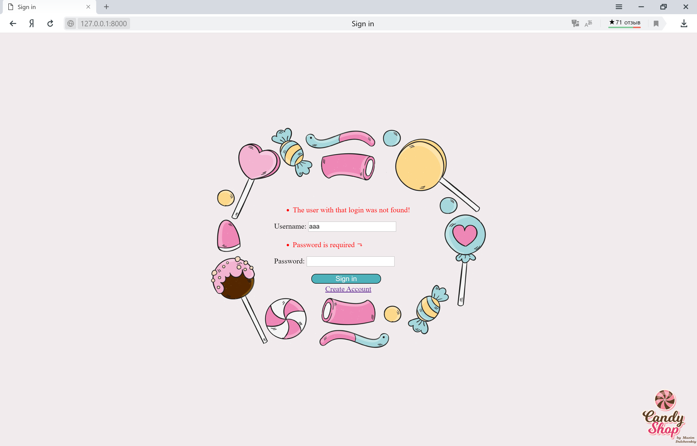 </p>

- добавить ограничения на пользования сайтом. Если пользователь зашел на сайт в промежутке с 22:00 до 08:00, возможность оформления заказа 
у него отсутствует;

<p align="center">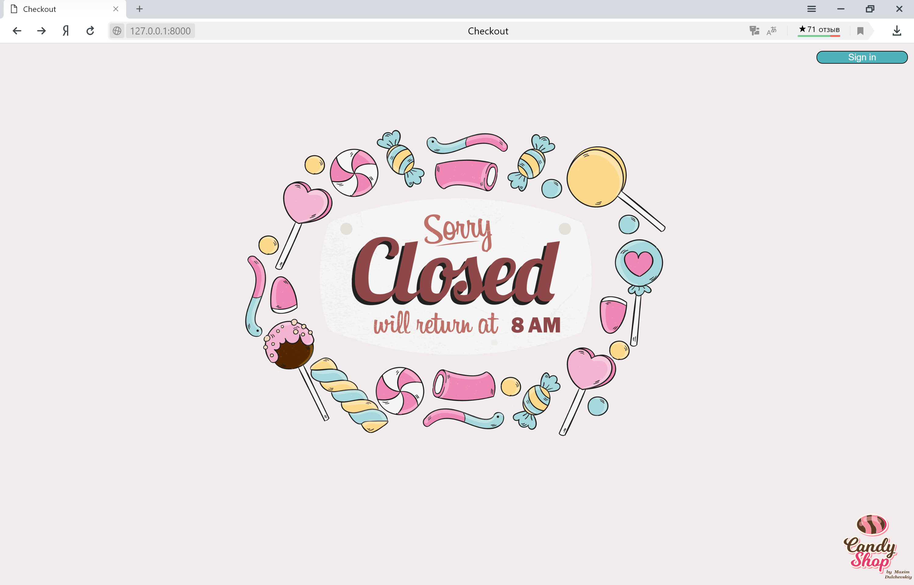</p>

- покрыть тестами основную функциональность.

### Features:
- в файле "settings.py" задается время работы магазина ("CLOSING_HOUR", "OPENING_HOUR"). Часы открытия менять не рекомендуется т.к. для 
обозначения закрытия магазина используется изображение, где указано время открытия "8 AM";
- в файле "settings.py" указывается почта админа, на которую будет дублироваться информация о совершенных заказах. Если почту не
указывать, для дублирования информации о совершении заказа будет использоваться почта суперпользователя;
- в файле "settings.py" указывается количество категорий сладостей, которые выводятся в одной строке ("SWEETS_ON_THE_LINE");
- в файле "settings.py" задаются названия изображений для соответствующих групп сладостей ("SWEET_PIC_NAMES"). Если добавлена
новая категория, а ее изображение нет, то на главной странице будет выводиться соответствующее изображение;

<p align="center">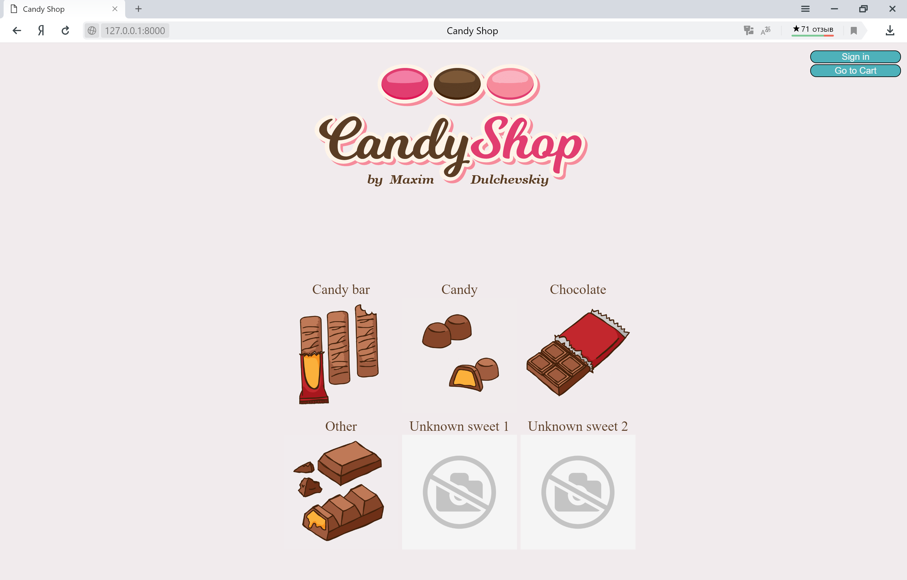</p>

- при удалении, добавлении или изменении количества несуществующей сладости, будет показана страница с ошибкой;
- при переходе на страницу несуществующей категории сладости, будет показана страница с ошибкой;

<p align="center">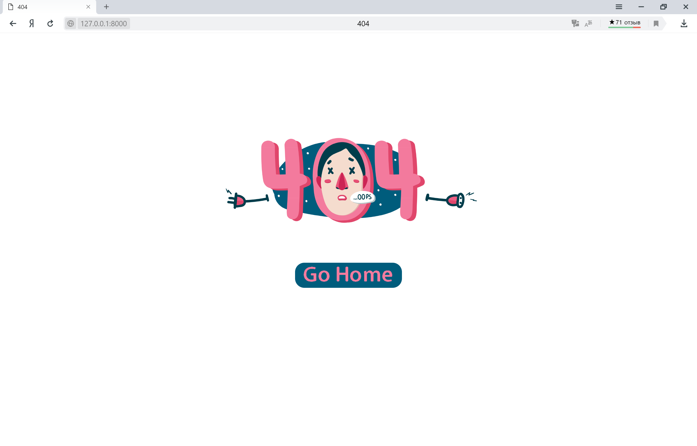</p>

- для неочевидных изменений в корзине/заказе добавлены информационные сообщения;

<p align="center"> 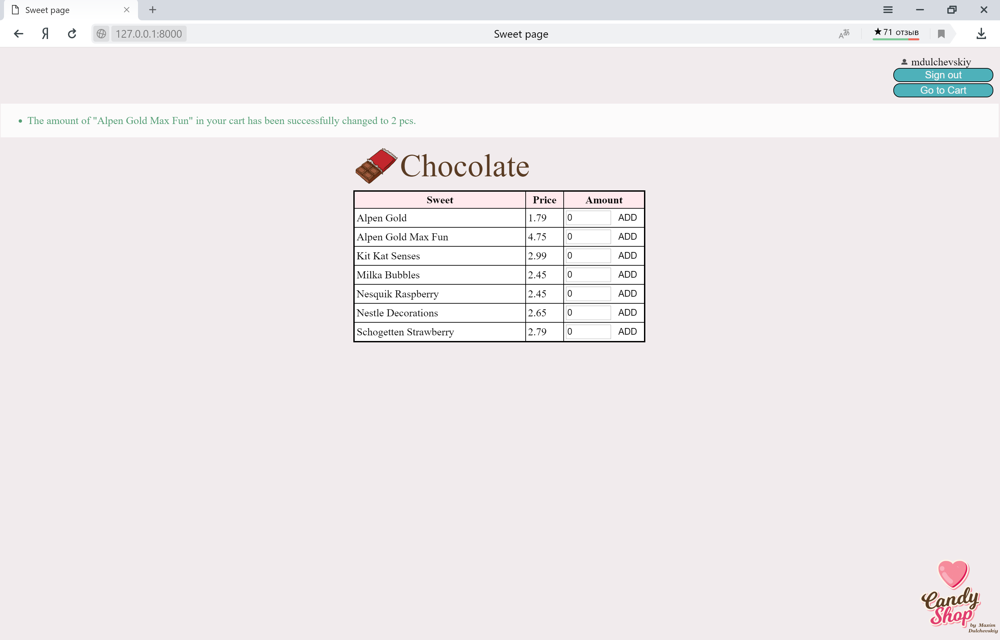</p>

- после совершения заказа проверяется наличие соединения с интернетом для отправки подтверждения на почту. В зависимости от данной
проверки на главной странице будет выведено соответствующее уведомление;

<p align="center">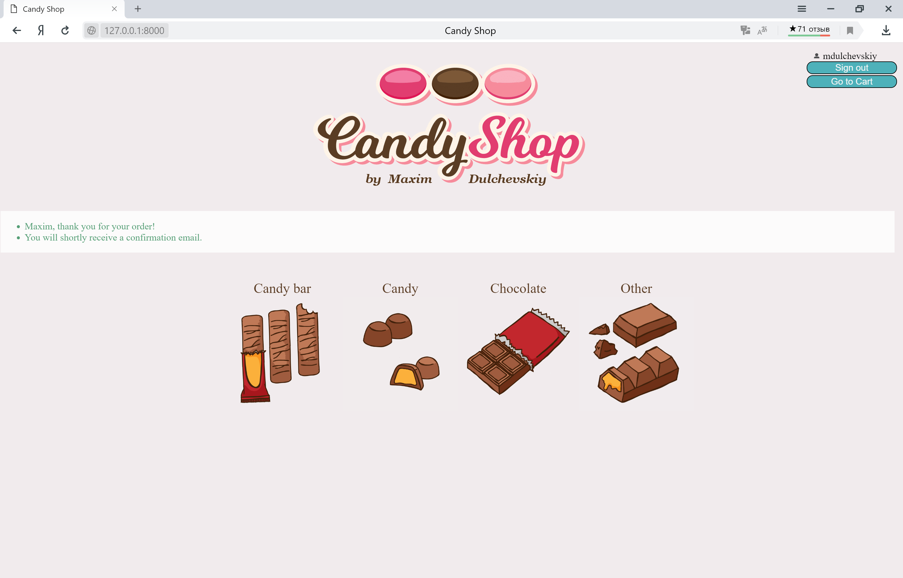 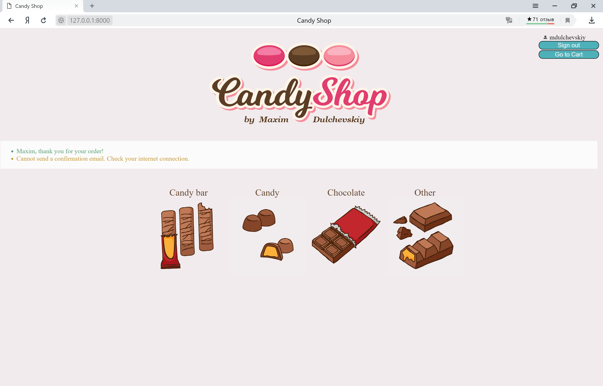</p>

- после авторизации или выхода пользователя реализован переход на страницу, с которой эти действия были инициированы;
- на странице "db/" отображается информация из таблиц "Order" и "User" с возможностью удаления записей.

<p align="center">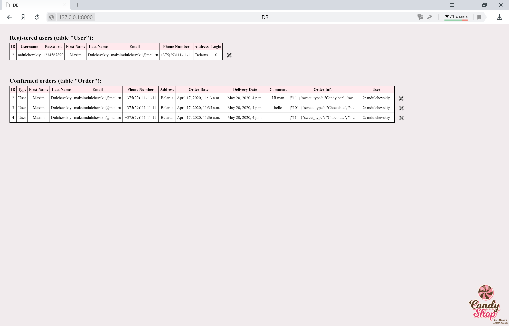</p>

## Getting Started
### Installing virtualenv
```
pip install virtualenv
```
### Start a new virtualenv container
```
virtualenv -p python3 directory/name
```
activate
```
source bin/activate
```
deactivate
```
deactivate
```
### Installing packages
```
pip install -r requirements.txt
```
### Run Server
```
python manage.py runserver
```
## Running the tests
```
python manage.py test candy_shop
```
